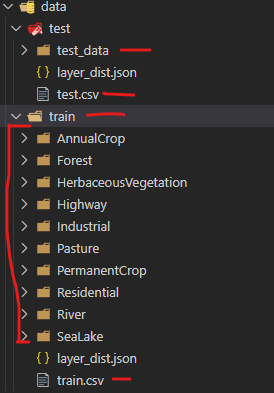

# AIML2022

Before using the code you might need to install a few dependencies (rasterio would not work on our windows machine so we had to find a workaround and used tifffile to read in the files).

```
pip install tifffile tqdm
```

Furthermore, please ensure the working directory where the code is executed has a subfolder 'data' which has the following structure. Note the layer_dist.json files will be created when executing the code. However, the elements marked in red must be provided. The *.npy files from the test file should be provided in the test_data folder.
For faster ease of use the *.csv files and *.json files are provided in the repository.

